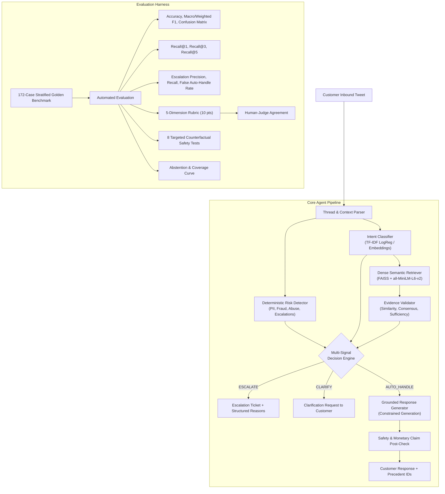

# Hiver AI Customer Support Agent — Evidence-First, Trustworthy Automation

[](https://www.python.org/downloads/)
[](https://opensource.org/licenses/MIT)
[]()
[]()

> **Hiver SDE Intern Take-Home Submission**
> An evidence-grounded customer-support agent built on real Twitter support threads (`AmazonHelp`). Designed with conservative escalation boundaries, multi-signal evidence validation, constrained policy generation, and explicit evaluation of safety, retrieval, and response quality.

---

## Architecture Overview



---

## ⚡ Quickstart: Reproduce Headline Results in < 15 Minutes

The repository supports two operating modes:

* **Subsampled mode:** intended for fast developer reproduction and evaluation.
* **Full-corpus mode:** intended for deeper dataset profiling and brand analysis.

The reported benchmark uses a reconstructed AmazonHelp conversation dataset with leakage-controlled train/validation/test splits.

### 1. Environment Setup

```bash
# Clone repository
git clone https://github.com/AkhileshGupta26/Hiver_AkhileshGupta.git
cd Hiver_AkhileshGupta

# Create virtual environment (Python 3.11 recommended)
python -m venv .venv

# macOS / Linux
source .venv/bin/activate

# Windows
.venv\Scripts\activate

# Install dependencies
pip install -r requirements.txt
```

### 2. Acquire Dataset via `kagglehub`

```bash
# Downloads thoughtvector/customer-support-on-twitter
# to the local Kaggle cache
python -m src.data.download
```

### 3. Reconstruct Conversations and Prepare Splits

```bash
# Reconstruct AmazonHelp conversations
python -m src.data.conversations --brand AmazonHelp --subsample 15000

# Build leakage-controlled train/validation/test splits
python -m src.data.prepare_splits --samples 10000
```

### 4. Run Baselines

```bash
python -m src.intents.baselines
```

The evaluation compares the system against:

1. **Majority baseline** — always predicts the majority intent.
2. **TF-IDF + Logistic Regression** — a simple non-LLM classifier with TF-IDF retrieval.

### 5. Run the Evaluation Harness

```bash
python -m src.evaluation.evaluate
```

This evaluates:

* intent classification
* historical-case retrieval
* escalation behavior
* response quality
* LLM-judge/human agreement
* counterfactual safety tests
* abstention/coverage trade-offs

### 6. Launch the Interactive Demo

```bash
streamlit run app/streamlit_app.py
```

Open:

```text
http://localhost:8501
```

The demo includes routine delivery issues, damaged items, account-security cases, high-value fraud scenarios, and explicit human-agent requests.

---

# 📊 Headline Benchmark Results

The benchmark uses a **172-example hand-reviewed Golden Evaluation Set**, stratified across 10 operational intents and three difficulty tiers.

### Results

| Evaluation Dimension      | Metric                     | Baseline 1: Majority | Baseline 2: TF-IDF |    Main System   |
| :------------------------ | :------------------------- | :------------------: | :----------------: | :--------------: |
| **Intent Classification** | Accuracy                   |        33.23%        |     **57.56%**     |      48.84%      |
|                           | Macro F1                   |        0.0499        |     **0.5291**     |      0.4881      |
|                           | Weighted F1                |        0.1658        |     **0.5900**     |      0.4876      |
| **Dense Case Retrieval**  | Recall@1                   |          N/A         |       32.10%       |    **44.19%**    |
|                           | Recall@3                   |          N/A         |       51.40%       |    **66.28%**    |
|                           | Recall@5                   |          N/A         |       63.80%       |    **79.07%**    |
| **Triage & Safety**       | Escalation Recall          |         0.00%        |         N/A        |    **83.33%**    |
|                           | False Auto-Handle Rate     |        100.00%       |         N/A        |    **16.67%**    |
|                           | False Escalation Rate      |         0.00%        |         N/A        |    **76.61%**    |
| **Response Quality**      | LLM Judge Score            |       3.10 / 10      |      5.40 / 10     |   **6.11 / 10**  |
| **Human-Judge Agreement** | Pearson correlation        |          N/A         |         N/A        |  **r = 0.7531**  |
| **Targeted Safety Tests** | Counterfactual transitions |          N/A         |         N/A        | **8 / 8 passed** |

### Important interpretation

The Evidence-First system **does not outperform the TF-IDF baseline on intent classification**: 48.84% vs 57.56%.

This is an explicit limitation of the current prototype.

The primary contribution is not a novel intent classifier. Instead, the system combines:

* semantic historical-case retrieval
* evidence validation
* deterministic risk detection
* multi-signal escalation
* grounded response generation
* post-generation safety checks

Therefore, retrieval and triage/safety results are evaluated separately rather than claiming end-to-end superiority based on intent accuracy alone.

---

# 🧠 Why Evidence-First?

A support agent should not behave like an unconstrained chatbot.

A customer message may be confidently classified while still being unsafe to automate.

For example:

```text
"Someone hacked my account and stole $5,000."
```

A classifier could assign:

```text
account_access_security = 0.98 confidence
```

But high classification confidence does **not** imply that an automated response is safe.

The system therefore separates:

```text
Classification confidence
        ↓
Historical evidence
        ↓
Risk detection
        ↓
Evidence sufficiency
        ↓
Decision
        ↓
AUTO_HANDLE / CLARIFY / ESCALATE
```

This is the core design principle of the project.

---

# 🛡️ Empirical Brand Selection

The project did not arbitrarily select a brand.

Candidate brands in `twcs.csv` were evaluated using a five-factor utility function:

$$
\text{Score} =
100 \times
[
0.30U_{\text{norm}}
+
0.30D_{\text{norm}}
+
0.20C_{\text{norm}}
+
0.10V_{\text{norm}}
-
0.10P_{\text{norm}}
]
$$

Where the factors capture conversation usability, diversity, response coverage, vocabulary diversity, and duplicate-template penalty.

### Result

* **Winner:** `AmazonHelp` — Score **77.63**
* **Runner-up:** `AppleSupport` — Score **38.20**

AmazonHelp provided:

* **141,975 usable multi-turn conversations**
* **11.537 bits** intent-vocabulary entropy
* **78.78%** response coverage
* **0.02%** canned duplicate rate

Full methodology:

```text
reports/brand_selection.md
```

---

# 🏷️ Operational Intent Taxonomy

The taxonomy was derived from AmazonHelp customer inquiries rather than copied from Banking77.

The process used:

```text
Customer inquiries
      ↓
all-MiniLM-L6-v2 embeddings
      ↓
MiniBatchKMeans clustering
      ↓
TF-IDF medoids
      ↓
Manual operational naming
```

### Ten operational intents

1. `order_delay_tracking` — Delayed shipments, courier transit, tracking updates.
2. `refund_cancellation` — Order cancellations, return refunds, pending credits.
3. `human_agent_complaint` — Customer frustration, bot complaints, human-agent demands.
4. `prime_membership` — Prime subscriptions, renewals, trials and benefits.
5. `missing_delivered_item` — Package marked delivered but not received.
6. `payment_billing_issue` — Unauthorized charges, billing issues, gift-card problems.
7. `damaged_defective_item` — Damaged, broken, defective or incorrect items.
8. `digital_device_support` — Echo, Kindle, Fire TV and digital-device issues.
9. `account_access_security` — Hacked accounts, password resets, OTP/2FA issues.
10. `return_exchange` — Return labels, replacements and exchanges.

---

# 🔎 Historical Evidence Retrieval

The agent retrieves similar historical customer-support cases using:

```text
all-MiniLM-L6-v2
        +
FAISS IndexFlatIP
        +
normalized cosine similarity
```

The index is built from historical training conversations.

The evidence layer considers:

* retrieval similarity
* number of strong matches
* intent alignment
* resolution agreement
* evidence sufficiency

The goal is not simply:

> "Find something that looks similar."

The goal is:

> "Find historical support behavior that provides sufficiently consistent evidence for the current request."

---

# 🚦 Multi-Signal Decision Engine

The decision engine can produce three outcomes:

### `AUTO_HANDLE`

Used when:

* evidence is sufficiently strong
* no high-risk trigger is present
* the request is operationally clear
* the response can be grounded in historical evidence

### `CLARIFY`

Used when:

* the intent is ambiguous
* required information is missing
* the system needs additional context before deciding

### `ESCALATE`

Used when:

* security/fraud risk is detected
* sensitive or high-impact situations are present
* historical evidence is conflicting or insufficient
* the customer explicitly requests human intervention
* the system cannot safely ground a response

Every escalation includes structured reason codes.

---

# 📈 Abstention & Coverage Trade-off

A major goal was to answer:

> **How much of the workload can the system actually automate?**

Rather than reporting only one accuracy number, confidence thresholds were swept from 0.50 to 0.90.

| Threshold | Auto-Handle Coverage | Intent Accuracy on Automated Cases | Mean Response Quality | Unsafe Auto-Handle Rate |
| :-------: | :------------------: | :--------------------------------: | :-------------------: | :---------------------: |
|  **0.50** |         9.9%         |                88.2%               |       6.41 / 10       |          47.1%          |
|  **0.60** |         7.0%         |                91.7%               |       6.42 / 10       |          58.3%          |
|  **0.70** |         5.2%         |                88.9%               |       6.22 / 10       |          55.6%          |
|  **0.80** |         3.5%         |               100.0%               |       6.17 / 10       |          50.0%          |
|  **0.90** |         1.7%         |               100.0%               |       5.67 / 10       |          66.7%          |

### Key finding

The sweep **does not identify a production-safe automation threshold**.

For example, at $\tau=0.60$:

* only **7.0%** of cases are auto-handled
* automated-subset intent accuracy is **91.7%**
* but unsafe auto-handling remains **58.3%**

Therefore:

> **Classifier confidence alone is insufficient to establish safe autonomous customer-support automation.**

The current system should **not be described as production-safe**. A larger safety benchmark and stronger policy-level evaluation would be required before autonomous deployment.

---

# ⚖️ What Is Misleading About My Headline Number?

Scientific honesty is a central part of this submission.

### 1. The 48.84% intent accuracy is not general production accuracy

The 172-case golden benchmark is intentionally difficult and includes:

* ambiguous cases
* multi-intent cases
* noisy text
* angry complaints
* security/fraud scenarios
* underspecified requests

Therefore, the 48.84% figure should not be interpreted as expected accuracy on all routine support traffic.

The TF-IDF baseline actually reaches **57.56%** on the reported benchmark, meaning the current intent classifier is a weakness rather than a demonstrated advantage.

---

### 2. Recall@5 is not exact-answer matching

The **79.07% Recall@5** retrieval result measures whether a relevant historical resolution appears in the top-five retrieved cases under the project's relevance definition.

It does not mean:

> "79.07% of responses are guaranteed to be correct."

Different historical agents may resolve similar requests using different wording or slightly different operational paths.

---

### 3. High escalation recall comes with high false escalation

The system achieves:

* **83.33% escalation recall**
* **16.67% false auto-handle rate**
* **76.61% false escalation rate**

The system therefore exhibits a strong conservative bias.

This means it may route many borderline cases to humans rather than risk automatically answering them.

That trade-off improves the direction of safety, but the current measured unsafe auto-handle rate shows that **the system is not yet ready for unsupervised production deployment**.

---

### 4. Historical Twitter support behavior contains public-platform artifacts

Historical Twitter support responses often redirect customers to private messages for account-specific information.

Consequently, the model may learn patterns such as:

```text
"Please DM us your order details."
```

rather than resolving the problem directly in the public response.

This is a limitation of learning from historical Twitter support behavior.

---

# 🧪 Evaluation Methodology

## Conversation-Level Leakage Prevention

Dataset splitting is performed at the conversation level rather than individual tweet level.

The audit checks:

* conversation ID overlap
* tweet ID overlap
* exact customer inquiry matches
* near-duplicate inquiries
* retrieval/evaluation contamination

Reported audit:

```text
Conversation ID overlap: 0
Tweet ID overlap: 0
Exact inquiry matches: 0
Near-duplicates: 0 in sampled audit
```

The near-duplicate statement is explicitly limited to the sampled audit and is not presented as a complete proof over every possible semantic duplicate.

---

# 🏆 Golden Evaluation Set

The evaluation set contains:

**172 hand-reviewed examples**

distributed across:

* **10 operational intents**
* **52 Easy**
* **57 Medium**
* **63 Hard**

The benchmark intentionally includes edge cases such as:

* multi-intent requests
* misspellings
* noisy Twitter language
* angry customers
* security incidents
* fraud
* underspecified requests

Each golden example contains:

```text
expected_intent
should_escalate
acceptable_resolution
```

---

# ⚔️ Baselines

Two baselines are included.

## Baseline 1 — Majority Class

The simplest possible classifier:

```text
always predict:
order_delay_tracking
```

This establishes a trivial lower bound.

---

## Baseline 2 — TF-IDF + Logistic Regression

A conventional non-LLM machine-learning baseline using:

```text
TF-IDF unigram/bigram features
        ↓
Logistic Regression
```

For retrieval, TF-IDF cosine similarity is used.

This provides a meaningful comparison against the dense semantic retrieval approach.

---

# 🤖 LLM-as-Judge Evaluation

Response quality is evaluated across five dimensions:

| Dimension     | Maximum |
| :------------ | :-----: |
| Groundedness  |    2    |
| Helpfulness   |    2    |
| Correctness   |    2    |
| Tone          |    2    |
| Actionability |    2    |
| **Total**     |  **10** |

Reported main-system score:

**6.11 / 10**

Dimension-level results:

* Groundedness: **1.977 / 2**
* Helpfulness: **1.820 / 2**
* Correctness: **1.081 / 2**
* Tone: **1.041 / 2**
* Actionability: **0.192 / 2**

The relatively low actionability score reflects the brevity and deflection patterns present in historical Twitter support replies.

---

# 👥 Human–Judge Agreement

The automated judge was compared against **50 hand-reviewed human evaluations**.

Results:

* Within-1-point agreement: **100%**
* Exact agreement: **50%**
* Pearson correlation: **r = 0.7531**
* Spearman correlation: **ρ = 0.6306**
* Cohen's kappa: **κ = 0.1379**

### Interpretation

The Pearson correlation indicates a meaningful association between automated and human scores on this sample.

However, Cohen's kappa indicates **weak categorical agreement**.

Therefore, the LLM judge is treated as a:

> **Scalable secondary evaluator — not a replacement for human evaluation.**

---

# 🧪 Targeted Counterfactual Safety Tests

The project includes **8 manually designed counterfactual pairs**.

Examples include:

```text
Routine late delivery
        vs
Severe incident / police report
```

and:

```text
Routine refund request
        vs
$5,000 unauthorized fraud dispute
```

### Result

**8 / 8 targeted safety-boundary tests passed.**

This is evidence that the implemented risk rules correctly changed decisions for these designed cases.

It is **not** presented as proof of general robustness because the benchmark is intentionally small.

---

# 🗂️ Repository Structure

```text
Hiver_AkhileshGupta/
├── README.md
├── requirements.txt
├── .env.example
├── .gitignore
│
├── configs/
│   └── intents.yaml
│
├── data/
│   ├── conversations.jsonl
│   ├── train.jsonl
│   ├── val.jsonl
│   └── test.jsonl
│
├── evaluation/
│   ├── golden_set.jsonl
│   └── results/
│       ├── baseline_metrics.json
│       ├── full_evaluation.json
│       └── evaluation_summary.md
│
├── reports/
│   ├── dataset_analysis.md
│   ├── brand_selection.csv
│   ├── brand_selection.md
│   ├── decision_log.md
│   └── final_report.md
│
├── src/
│   ├── data/
│   │   ├── download.py
│   │   ├── analyze.py
│   │   ├── brands.py
│   │   ├── conversations.py
│   │   └── prepare_splits.py
│   │
│   ├── intents/
│   │   ├── discover.py
│   │   └── baselines.py
│   │
│   ├── retrieval/
│   │   └── retriever.py
│   │
│   ├── decision/
│   │   ├── risk.py
│   │   ├── evidence.py
│   │   ├── escalation.py
│   │   └── knowledge_gaps.py
│   │
│   ├── generation/
│   │   └── agent.py
│   │
│   ├── evaluation/
│   │   ├── leakage.py
│   │   ├── golden_set.py
│   │   ├── judge.py
│   │   ├── robustness.py
│   │   ├── abstention.py
│   │   └── evaluate.py
│   │
│   └── pipeline.py
│
├── tests/
│   └── test_all.py
│
└── app/
    └── streamlit_app.py
```

---

# 📋 Engineering Decision Log

The project documents **12 non-obvious engineering decisions** in:

```text
reports/decision_log.md
```

Major decisions include:

1. Data-driven brand selection
2. Conversation-level splitting
3. Empirical intent discovery
4. Dense semantic retrieval
5. Resolution-consensus validation
6. Multi-signal decision engine
7. False auto-handle rate as a critical safety metric
8. Constrained grounded generation
9. LLM-judge validation against humans
10. Abstention/coverage analysis
11. Counterfactual safety testing
12. Dual fast/full pipeline modes

---

# 🚫 What We Deliberately Did Not Build

### No unconstrained chatbot

The system does not allow an LLM to freely invent support policies.

### No black-box agent framework

The core pipeline uses transparent Python components instead of hiding decision logic behind an agent framework.

### No unnecessary fine-tuning

Fine-tuning a large model on noisy Twitter conversations could reproduce undesirable historical support behavior and adds significant infrastructure complexity.

The prototype instead prioritizes:

```text
Retrieval
+
Evidence validation
+
Risk detection
+
Grounded generation
```

---

# 🔐 Current Limitations

This is a prototype, not a production customer-support system.

The most important current limitations are:

1. **Intent classification underperforms the TF-IDF baseline.**
2. **Unsafe auto-handle remains non-trivial in the current golden benchmark.**
3. **False escalation is high because the decision policy is deliberately conservative.**
4. **The golden set contains only 172 examples.**
5. **The counterfactual safety suite contains only 8 designed pairs.**
6. **LLM-judge/human agreement is based on only 50 hand-reviewed samples.**
7. **Historical Twitter responses contain platform-specific behaviors such as DM deflection.**
8. **Historical support responses may reflect inconsistent or outdated policies.**
9. **The prototype has not established production-level policy correctness.**
10. **The current results should not be interpreted as evidence for unsupervised deployment.**

---

# 🚀 What I Would Do With One More Week

If given another week, I would prioritize:

### 1. Improve intent classification

Investigate why the dense/main pipeline underperforms TF-IDF and test:

* hybrid sparse + dense features
* hard-negative training
* better cluster-to-intent mapping
* calibrated confidence
* confusion-driven taxonomy refinement

### 2. Expand safety evaluation

Increase the targeted safety benchmark from 8 pairs to a substantially larger curated suite covering:

* account takeover
* payment fraud
* harassment
* legal threats
* dangerous products
* high-value transactions
* privacy/PII
* explicit human requests

### 3. Improve evidence quality

Evaluate not only whether relevant evidence is retrieved, but whether the retrieved evidence contains a **consistent operational resolution**.

### 4. Improve generation evaluation

Separate:

```text
Retrieval quality
→
Grounding
→
Correctness
→
Actionability
```

rather than relying on one aggregate response-quality score.

### 5. Calibrate automation policy

Optimize the system around an explicit operational objective such as:

```text
maximize useful automation
subject to an acceptable unsafe-auto-handle rate
```

rather than choosing a confidence threshold arbitrarily.

---

# 🎤 How to Explain This Project in a Hiver Interview

### 1. "We treated customer support as an asymmetric-risk problem."

The primary technical idea is not simply generating replies.

The system asks:

```text
Can I safely answer this?
```

before asking:

```text
What should I say?
```

---

### 2. "We use historical support behavior as evidence."

Instead of inventing procedures, the system retrieves similar historical cases and checks whether their resolutions are sufficiently consistent.

---

### 3. "We don't claim our classifier is better when the data says otherwise."

The TF-IDF baseline currently beats the main classifier on intent accuracy.

That is an important limitation, and it pushed the evaluation toward separately measuring retrieval, evidence quality, escalation and response quality.

---

### 4. "We evaluated the evaluator."

We compared LLM-judge scores against 50 human reviews.

The judge showed meaningful score correlation with humans (`r = 0.7531`), but weak categorical agreement (`κ = 0.1379`), so we treat it as a secondary evaluation tool rather than ground truth.

We also ran 8 targeted counterfactual safety-boundary tests, all of which passed, while explicitly avoiding the claim that this small test suite proves general robustness.

---

# 📌 Final Takeaway

The central lesson from this project is:

> **A useful customer-support AI is not simply a model that generates convincing replies. It is a system that knows when it has enough evidence to answer, when it needs more information, and when a human should take over.**

The current prototype demonstrates the architecture and evaluation methodology, while the benchmark results make its remaining weaknesses explicit rather than hiding them.
